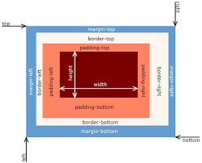

## HTML - ATTRIBUTES, CLASS AND IDS

### ATTRIBUTES

- Elements in HTML have attributes which are additional values that configure the elements or adjust their behavior in various ways to meet the criteria the users want.
- Examples of HTML attributes are :

1. href

            <a href="google">Home</a>

2. src

            <p src="google">Home</p>   

3. lang

            <html lang="en-US"></html>

4. title

            <p title="Google"></p>

5. alt

             

### CLASS ATTRIBUTE

- The HTML class attribute makes it possible to define equal styles for "equal"  <div> element:


        <div class="cities">
        <h1>Lusaka</h1>
        <p>Lusaka is the capital city of Zambia. It is the most populous city in Zambia, with Kulima tower area of over 13 million inhabitants.</p>
        </div>

### ID ATTRIBUTE

- HTML id attribute defines an identifier (ID) which is usually unique in a document. The main purpose of an ```ID``` is to identify the element when linking, scripting or styling (with CSS).
- Example:


        <p id="exciting">The most exciting paragraph on the page. One of a kind!</p>

- ```div``` tag defines a division or section in an HTML document. ```div``` is used as a box or container for HTML elements which is styled with CSS or manipulated with JavaScript.
- ```div``` is usually styled by using a class or an id attribute.
- A ```form``` tag in HTML is used to create an HTML form for user input.

### CSS

- The font-family property specifies the font for an element.
- font-size property sets the font size of any text element on a page or website.

### CSS BOX MODEL



- Content contains text, images etc
- Paddling is the transparent area around the content, inside of the box
- Border goes around the paddling and content
- Margin is the space between boxes
- Fill area is the area which gets filled with background color or background image


